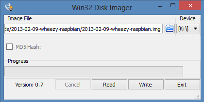

# Raspberry Pi: Getting Started
## Wat is de Rasberry Pi

De Raspberry Pi is een singleboard computer gebaseerd op een ARM chipset. Een
singleboard computer bestaat uit maar een printplaat. Een singleboard computer
zorgt er voor dat alle hardware compatible is. De rasperberry pi heeft
standaard geen omkasting, in combinatie met GPIO pinnen maakt dit een zeer
interessant soft -en hardware hacking platform. Als OS gebruikt de Pi een linux
variant gebaseerd op Debian. Omdat de we gebruik maken van een linux OS, kunnen
we gebruik maken van een groot deel van de beschikbare linux software indien
deze gecompileerd is voor een ARM architectuur. We kunnen ook onze eigen 
software schrijven voor de Pi, de meeste gebruikte talen zijn C++ en python.  
De Pi 2B ondersteunt ook Windows 10 IoT core. 

De Pi is een single board computer maar om het systeem werkend te krijgen 
hebben we nog enkele pheriperals nodig. Voor de Raspberry Pi 2B is dit:
* Voeding (5V @ 2A is aanbevolen)
* Micro SD
* Muis 
* Toetsenbord
* Scherm

De Micro SD en voeding zijn altijd nodig. Eens de initiële configuratie is
gedaan kunnen we de Pi configuren over een remote connectie met SSH of een 
andere remote configuratie tool. De Pi beschikt alleen over een ethernet 
connectie voor internet acces. Dit is wel uitbreidbaar met een WiFi dongle.

De Raspberry Pi is dus een kleine computer waaruit we veel mee kunnen leren en
coole projecten mee kunnen realiseren. De Pi wordt vaak gebruikt voor server in
een huiselijke situatie op te zetten.

Wil je al aan de slag gaan en zoek je een leuk projectje of inspiratie opdoen,
klik dan op deze [link](https://hackaday.io/search?term=Raspberry+PI).

### ARM Single Board Computer Vergelijking
Er zijn al enkele versie van de Raspberry Pi op de markt. De Pi is niet de
enigste ARM Single Board Computer op de markt, 2 bekende alternativen zijn de
Banana Pi en de Beagle Bone. Hieronder staat een vergelijkende tabel met hun
hardware eigenschappen.

Nog een interessante ARM board is de [PINE64](http://pine64.com/). Dit board
heeft juist een succesvolle kickstarter achter de rug en zal een geducthte
concurrent zijn voor de Pi. 

|Single Board Computer   |Processor                |RAM   |Geheugen  |Video            |Audio                       |Aanbevolen voeding |
|---                     |---                      |---   |---       |---              |---                         |---                |
|Beagle Bone Black       |1 GHz ARM A8             |512MB |4GB       |Micro HDMI       |Via HDMI                    |500mA @ 5V         |
|Banana Pi               |1 GHz ARM A7 Dual Core   |1GB   |SD + SATA |HDMI + Composiet |Via HDMI + 3,5mm audio jack |1A @ 5V            |
|Raspberry Pi A          |700 MHz ARM11            |256MB |SD        |HDMI + Composiet |Via HDMI + 3,5mm audio jack |1A @ 5V            |
|Raspberry Pi A+         |700 MHz ARM11            |256MB |SD        |HDMI + Composiet |Via HDMI + 3,5mm audio jack |1A @ 5V            |
|Raspberry Pi B          |700 MHz ARM11            |512MB |Micro SD  |HDMI + Composiet |Via HDMI + 3,5mm audio jack |2A @ 5V            |
|Raspberry Pi B+         |700 MHz ARM11            |512MB |Micro SD  |HDMI + Composiet |Via HDMI + 3,5mm audio jack |2A @ 5V            |
|Raspberry Pi 2B         |900 MHz ARM A7 Quad Core |512MB |Micro SD  |HDMI + Composiet |Via HDMI + 3,5mm audio jack |2A @ 5V            |
|Raspberry Pi Zero       |1GHz ARM11               |1GB   |Micro SD  |Micro HDMI       |Via HDMI                    |700mA @ 5V         |

## Operating System

Er zijn verschillende linux varianten beschikbaar voor de Rasperberry Pi. De
versie die we tijdens het labo gebruiken is Rasbian Jessie Lite.
Deze is te download op de officiële site van Raspberry Pi.

Er zijn nog andere linux distro beschikbaar voor. Deze zijn:
* Arch Linux
* Kali Linux
* OpenELEC
* Fedora 
* Ubuntu MATE
* ...

> In de labos zal alles uitgelegd worden met Raspbian. Je mag op
> eigen verantwoordelijkheid ook een eigen distributie kiezen.

### OS Installeren.
De Pi heeft geen ingebouwd geheugen, het gebruikt een Micro SD kaart voor data
opslag. Willen we het OS flashen op de SD kaart dan gebruiken we op Windows het
Win32 Disk Imager programma en op Linux maken we gebruik van het dd commando.

## Win32 Disk Imager
Win32 Disk Imager is een tool waarmee we een image kopieren naar een fysieke
schijf. Met Win32 maken we een kloon van een fysieke schijf. Win32 Disk Imager
kunnen we downloaden met deze
[link](http://sourceforge.net/projects/win32diskimager/).

Eens de Win32 Disk Imager is geinstalleerd, kan je het programma gebruiken om
de Pi image te kopieren naar de SD kaart.

1. Open Win32 Disk Imager 
2. Selecteer de image door op het folder icoon te drukken.
3. Selecteer het device, dit is drive letter voor de SD kaart.
4. Press Write

## Possible Topics
* Broadcom SoC
* Shared USB Bus
* ARM vs x64 vs i386 

